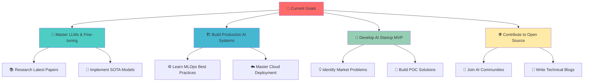

<!-- Nilkanth Ahire's Revamped GitHub README (Modern, Stylish, Game-Theory-Inspired) -->

<!-- ✨ HERO HEADER ✨ -->
<div align="center">
  
</div>

<!-- 🧠 PSYCHOLOGICALLY OPTIMIZED CTA - HOOK USER IN IMMEDIATELY -->
<div align="center">
  
</div>

<!-- 📱 SOCIALS (Top placement = higher conversion) -->
<div align="center">
  <a href="https://linkedin.com/in/nilkanthahire"></a>
  <a href="mailto:nilkanth8747@gmail.com"></a>
  <a href="https://medium.com/@nilkanthahire"></a>
</div>

---

<!-- 🧬 WHO AM I? -->
### 👨‍💻 Meet Nilkanth
```ts
const nilkanth = {
  title: 'AI Engineer | ML Specialist | Startup Enthusiast',
  location: 'Pune, India 🇮🇳',
  education: 'B.E. in AI & Data Science (9.26 CGPA)',
  mission: 'To build, ship, and scale real-world AI solutions that solve hard problems',
  traits: ['Innovator', 'Team-Player', 'Quick Learner', 'Builder'],
  currentFocus: ["LLMs", "Production-Ready AI Systems", "Real-time Inference"]
}
```

---

<!-- 🧠 SKILLS (Modern layout with icons and social proof) -->
### 🧰 My Tech Toolbox
<div align="center">
  
</div>

- 🧠 **AI/ML:** PyTorch, TensorFlow, Scikit-learn, OpenCV, HuggingFace
- 🔥 **LLMs & NLP:** LangChain, Transformers, Prompt Engineering
- ⚙️ **Backend:** FastAPI, REST, System Design, MLOps
- 📊 **Analytics:** Power BI, Tableau, SQL, Jupyter
- ☁️ **Cloud:** GCP, Firebase, Vercel
- 💻 **Dev:** Git, Docker, VSCode, Bash, Replit

---

<!-- 🎮 GAME THEORY / STATS (Proving social proof & triggers reciprocity) -->
### 🧠 GitHub Stats That Speak
<div align="center">
  
  
</div>

---

<div align="center">
  
</div>

## 🐍 **Contribution Chart**

<p align="center">
  
</p>

<div align="center">
  
</div>

## 🎯 Why Me?

<div align="center">
  
</div>

<div align="center">
  <table>
    <tr>
      <td align="center" width="33%">
        
        <h3>🚀 Fresh Perspective</h3>
        <p>Recent graduate with cutting-edge knowledge in AI/ML trends and technologies</p>
      </td>
      <td align="center" width="33%">
        
        <h3>💪 Proven Skills</h3>
        <p>Strong foundation in ML, Deep Learning, LLMs with hands-on project experience</p>
      </td>
      <td align="center" width="33%">
        
        <h3>🔥 Ready to Contribute</h3>
        <p>Eager to apply knowledge, learn fast, and deliver results from day one</p>
      </td>
    </tr>
  </table>
</div>

### 🏆 Key Strengths

<div align="center">

| 💡 **Innovation** | 🤝 **Collaboration** | 📈 **Growth Mindset** | ⚡ **Adaptability** |
|:---------:|:-------------:|:----------------:|:-------------:|
| Fresh ideas and creative problem-solving approach | Team player with excellent communication skills | Continuous learner, always updating skills | Quick to adapt to new technologies and frameworks |

</div>

<div align="center">
  
</div>

## 🎓 Education

<div align="center">
  
</div>

<div align="center">
  <table>
    <tr>
      <td>
        
      </td>
      <td>
        <h3>🎓 Bachelor of Engineering</h3>
        <h4>Artificial Intelligence & Data Science</h4>
        <p><strong>🏛️ Institution:</strong> D.Y. Patil Institute of Engineering, Management and Research, Akurdi</p>
        <p><strong>📅 Duration:</strong> 2022 - 2025</p>
        <p><strong>🎯 CGPA:</strong> 7.81/10.0</p>
        <p><strong>📍 Location:</strong> Pune, Maharashtra</p>
      </td>
    </tr>
  </table>
</div>

<div align="center"> 
<!--    -->
<!-- </div>  🏛️  D.Y. Patil Institute of Engineering           │ -->
<!-- │     Management and Research, Akurdi                 │ -->
<!-- │  📅 2022 - 2025                                    │ -->
<!-- │  🎯 CGPA: 7.81/10.0                               │ -->
<!-- ╰─────────────────────────────────────────────────────╯ -->
<!-- ``` -->

</div>

<div align="center">
  
</div>

## 🌟 **Daily Dev Inspiration**

<div align="center">
  


</div>

<div align="center">
  
</div>

## 🤝 **Connect & Collaborate**

<div align="center">

### 🚀 **Let's Build the Future Together!**

I'm passionate about connecting with fellow **AI researchers**, **ML engineers**, and **tech innovators**!

```
🔥 Open for Collaborations:
├── 🤖 AI/ML Research Projects
├── 🌟 Open Source Contributions  
├── 💡 Startup Opportunities
├── 📚 Knowledge Sharing Sessions
└── 🚀 Innovation Challenges
```

</div>

<div align="center">

### 📬 **Reach Out**

[](mailto:nilkanth8747@gmail.com)
[](https://www.linkedin.com/in/nilkanthahire)
[](https://medium.com/@nilkanthahire)

</div>

<div align="center">
  
</div>

## 🎯 **Current Roadmap**

<div align="center">



</div>

<div align="center">
  
</div>

## 💭 **Philosophy & Vision**

<div align="center">

```
╔══════════════════════════════════════════════════════════════╗
║                                                              ║
║  "Keep building. Keep learning. Keep moving.                 ║
║   Your proof-of-work will speak louder than anything else."  ║
║                                                              ║
║                              — Nilkanth Ahire                ║
║                                                              ║
╚══════════════════════════════════════════════════════════════╝
```

</div>


<div align="center">
  
</div>

<div align="center">

## 🏆 **Show Some Love!**


⭐ **Star my repositories if you find them interesting!**

[](https://github.com/nilkanth02)
[](https://github.com/nilkanth02)

If this README caught your attention, imagine what I can do for your projects!

</div>

<div align="center">
  
</div>
