<div align="center">
  
</div>

<div align="center">
<!--   <h1>
    
  </h1> -->

  <p align="center">
  
</p>

</div>

<div align="center">

[](https://www.linkedin.com/in/nilkanthahire)
[](https://medium.com/@nilkanthahire)
[](mailto:nilkanth8747@gmail.com)
[](https://github.com/nilkanth02)

</div>

<div align="center">
  
</div>

##  **About Me**

```python
class NilkanthAhire:
    def __init__(self):
        self.name = "Nilkanth Ahire"
        self.location = "🇮🇳 Pune, Maharashtra, India"
        self.education = "B.E. AI & Data Science (CGPA: 7.81)"
        self.role = "AI Engineer & Tech Enthusiast"
        self.mission = "Building AI solutions that matter"
        
    def get_skills(self):
        return {
            "languages": ["Python", "C++", "SQL", "JavaScript"],
            "ai_ml": ["TensorFlow", "PyTorch", "Scikit-learn", "OpenCV"],
            "nlp": ["NLTK", "Hugging Face", "LangChain", "LLMs"],
            "backend": ["FastAPI", "REST APIs", "System Design"],
            "databases": ["MySQL", "MongoDB", "Vector DBs"],
            "tools": ["Git", "Docker", "MLOps", "Cloud Platforms"]
        }
    
# Initialize AI Engineer
nilkanth = NilkanthAhire()
```

<div align="center">
  
</div>

## 💼 Tech Stack & Skills

<div align="center">
  
</div>

<table align="center">
  <tr>
    <td align="center" width="200">
      <h3>🚀 Programming</h3>
      
      <br/><br/>
      
      <br/>
      
    </td>
    <td align="center" width="200">
      <h3>🤖 AI/ML</h3>
      
      <br/><br/>
      
      <br/>
      
      <br/>
      
    </td>
    <td align="center" width="200">
      <h3>⚡ Backend</h3>
      
      <br/><br/>
      
      <br/>
      
    </td>
    <td align="center" width="200">
      <h3>🗄️ Databases</h3>
      
      <br/><br/>
      
      <br/>
      
    </td>
  </tr>
  <tr>
    <td align="center">
      <h3>🛠️ Tools</h3>
      
      <br/><br/>
      
      <br/>
      
    </td>
    <td align="center">
      <h3>☁️ Cloud & MLOps</h3>
      
      <br/><br/>
      
      <br/>
      
    </td>
    <td align="center">
      <h3>📊 Analytics</h3>
      
      <br/><br/>
      
      <br/>
      
    </td>
    <td align="center">
      <h3>🧠 Specializations</h3>
      
      <br/><br/>
      
      <br/>
      
    </td>
  </tr>
</table>

<div align="center">
  
</div>

##  **GitHub Stats**


<div align="center">
  
  
</div>

<div align="center">
  
</div>


<div align="center">
  
</div>

## 🐍 **Contribution Snake**

<p align="center">
  
</p>

<div align="center">
  
</div>

## 🎯 Why Hire Me?

<div align="center">
  
</div>

<div align="center">
  <table>
    <tr>
      <td align="center" width="33%">
        
        <h3>🚀 Fresh Perspective</h3>
        <p>Recent graduate with cutting-edge knowledge in AI/ML trends and technologies</p>
      </td>
      <td align="center" width="33%">
        
        <h3>💪 Proven Skills</h3>
        <p>Strong foundation in ML, Deep Learning, LLMs with hands-on project experience</p>
      </td>
      <td align="center" width="33%">
        
        <h3>🔥 Ready to Contribute</h3>
        <p>Eager to apply knowledge, learn fast, and deliver results from day one</p>
      </td>
    </tr>
  </table>
</div>

### 🏆 Key Strengths

<div align="center">

| 💡 **Innovation** | 🤝 **Collaboration** | 📈 **Growth Mindset** | ⚡ **Adaptability** |
|:---------:|:-------------:|:----------------:|:-------------:|
| Fresh ideas and creative problem-solving approach | Team player with excellent communication skills | Continuous learner, always updating skills | Quick to adapt to new technologies and frameworks |

</div>

<div align="center">
  
</div>

## 🎓 Education

<div align="center">
  
</div>

<div align="center">
  <table>
    <tr>
      <td>
        
      </td>
      <td>
        <h3>🎓 Bachelor of Engineering</h3>
        <h4>Artificial Intelligence & Data Science</h4>
        <p><strong>🏛️ Institution:</strong> D.Y. Patil Institute of Engineering, Management and Research, Akurdi</p>
        <p><strong>📅 Duration:</strong> 2022 - 2025</p>
        <p><strong>🎯 CGPA:</strong> 7.81/10.0</p>
        <p><strong>📍 Location:</strong> Pune, Maharashtra</p>
      </td>
    </tr>
  </table>
</div>

<div align="center"> 
<!--    -->
<!-- </div>  🏛️  D.Y. Patil Institute of Engineering           │ -->
<!-- │     Management and Research, Akurdi                 │ -->
<!-- │  📅 2022 - 2025                                    │ -->
<!-- │  🎯 CGPA: 7.81/10.0                               │ -->
<!-- ╰─────────────────────────────────────────────────────╯ -->
<!-- ``` -->

</div>

<div align="center">
  
</div>

## 🌟 **Daily Dev Inspiration**

<div align="center">
  


</div>

<div align="center">
  
</div>

## 🤝 **Connect & Collaborate**

<div align="center">

### 🚀 **Let's Build the Future Together!**

I'm passionate about connecting with fellow **AI researchers**, **ML engineers**, and **tech innovators**!

```
🔥 Open for Collaborations:
├── 🤖 AI/ML Research Projects
├── 🌟 Open Source Contributions  
├── 💡 Startup Opportunities
├── 📚 Knowledge Sharing Sessions
└── 🚀 Innovation Challenges
```

</div>

<div align="center">

### 📬 **Reach Out**

[](mailto:nilkanth8747@gmail.com)
[](https://www.linkedin.com/in/nilkanthahire)
[](https://medium.com/@nilkanthahire)

</div>

<div align="center">
  
</div>

## 🎯 **Current Roadmap**

```mermaid
graph TD
    A[🎯 Current Goals] --> B[🤖 Master LLMs & Fine-tuning]
    A --> C[🏗️ Build Production AI Systems]
    A --> D[🚀 Develop AI Startup MVP]
    A --> E[🌐 Contribute to Open Source]
    
    B --> F[📚 Research Latest Papers]
    B --> G[🔧 Implement SOTA Models]
    
    C --> H[⚙️ Learn MLOps Best Practices]
    C --> I[☁️ Master Cloud Deployment]
    
    D --> J[💡 Identify Market Problems]
    D --> K[🔨 Build POC Solutions]
    
    E --> L[🤝 Join AI Communities]
    E --> M[📝 Write Technical Blogs]
    
    style A fill:#ff6b6b
    style B fill:#4ecdc4
    style C fill:#45b7d1
    style D fill:#96ceb4
    style E fill:#ffeaa7
```

<div align="center">



</div>

<div align="center">
  
</div>

## 💭 **Philosophy & Vision**

<div align="center">

```
╔══════════════════════════════════════════════════════════════╗
║                                                              ║
║  "Keep building. Keep learning. Keep moving.                 ║
║   Your proof-of-work will speak louder than anything else."  ║
║                                                              ║
║                              — Nilkanth Ahire                ║
║                                                              ║
╚══════════════════════════════════════════════════════════════╝
```

</div>


<div align="center">
  
</div>

<div align="center">

## 🏆 **Show Some Love!**

⭐ **Star my repositories if you find them interesting!**

[](https://github.com/nilkanth02)
[](https://github.com/nilkanth02)


</div>

<div align="center">
  
</div>
